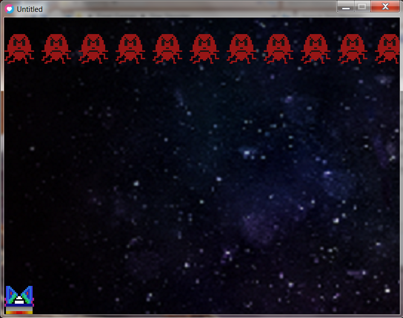
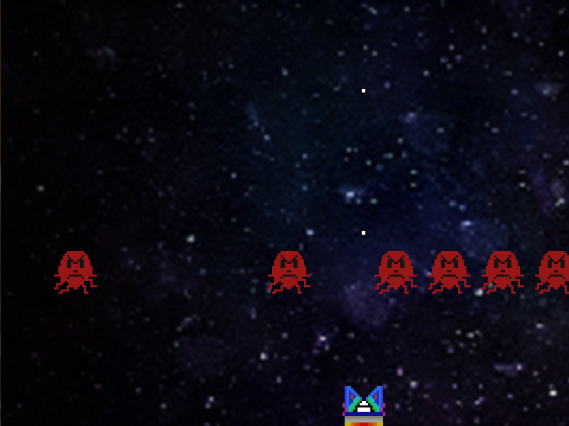
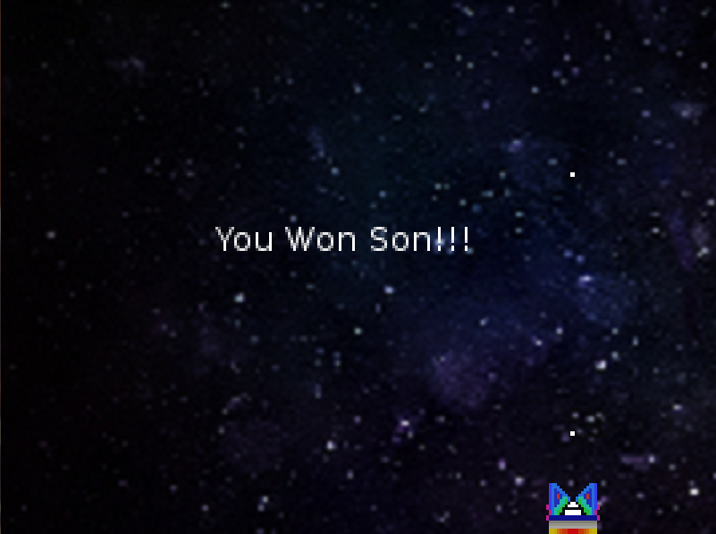
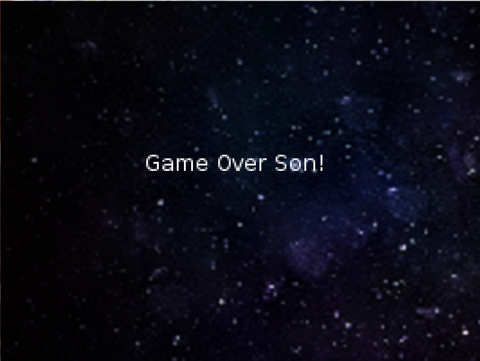

# Star_Shooter
First ever video game coded in programming language 'Lua' and tested in LOVE2D. Pixel art done in GIMP. 

This is what you see when you first start the game 

This is half way through, showcasing eliminating enemies as they scroll down the screen

If all enemies are eliminated before they get to the bottom of the screen 

If an enemy makes it to the bottom of the screen 

ENJOY! 

Aman Hafeez
Mechanical Engineer 
amanhaf@gmail.com
amanhafeez.com
